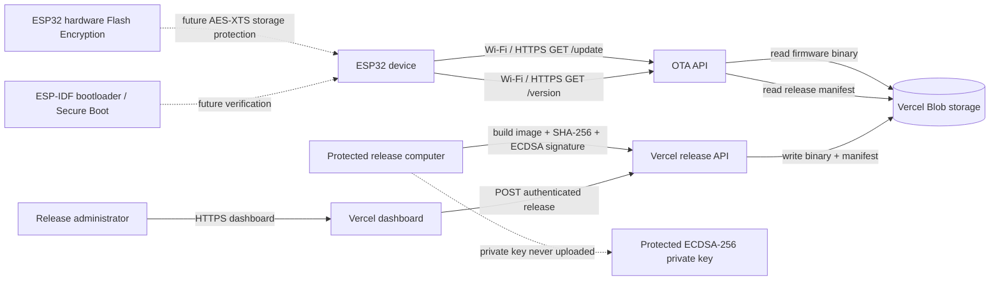
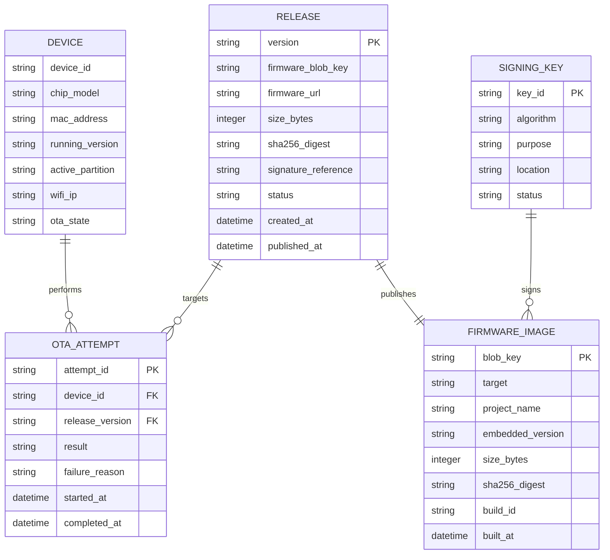
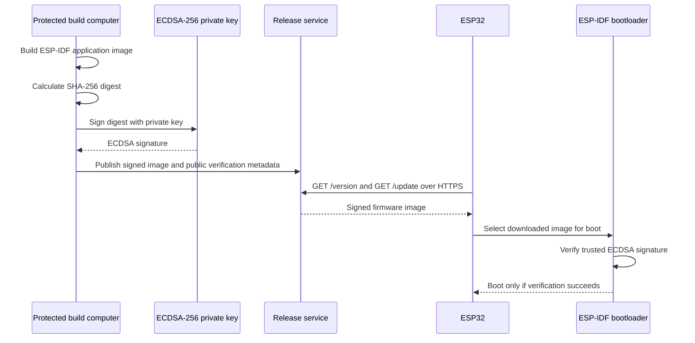
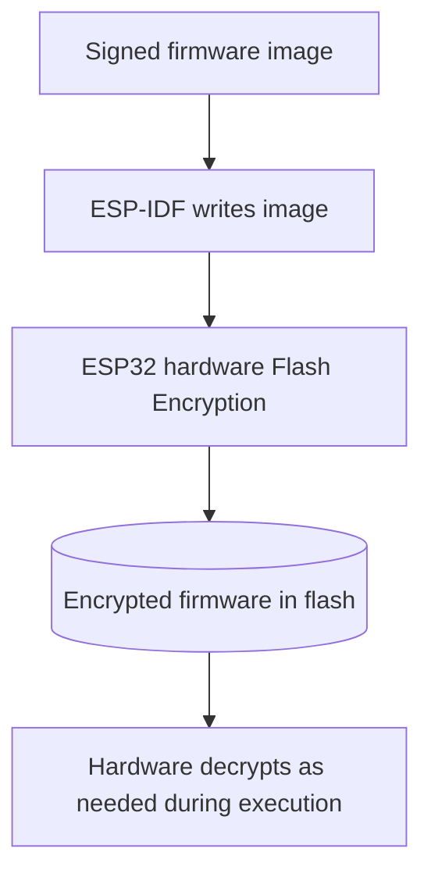
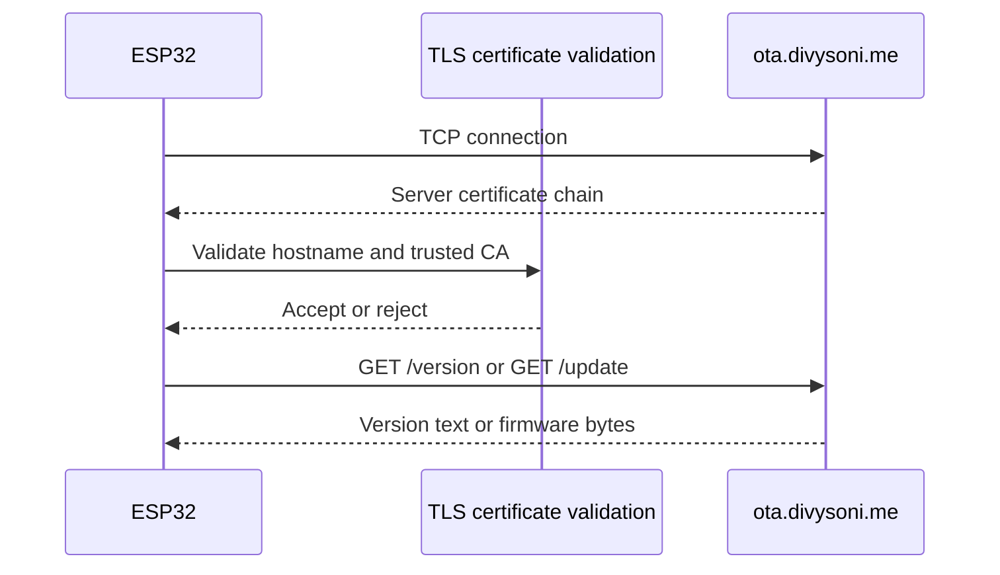

# ESP32 Secure OTA Project - ERD and System Data Flow

## 1. Scope

This document describes the system entities and relationships for the current local OTA service, the Vercel dashboard, firmware storage, and the future cryptographic security layer.

The diagram uses Mermaid. It can be rendered by GitHub, VS Code Markdown preview, or another Mermaid-compatible viewer.

## 2. System architecture



## 3. Data entities



## 4. Entity definitions

### DEVICE

The physical ESP32. The current application does not register device records in the dashboard. The device currently knows its embedded application version and obtains its IP from Wi-Fi. A future device-management feature can add a stable device identifier and update telemetry.

### RELEASE

The logical version made available to devices. The current Vercel API stores a small `release.json` manifest containing the version, binary size, and Blob URL. Production metadata should also include SHA-256, target, signature information, publication state, and timestamps.

### FIRMWARE_IMAGE

The compiled ESP-IDF binary. The current local server serves `build/esp32_secure_ota_2026_09_14.bin`. The Vercel dashboard uploads a binary under `releases/<version>.bin`.

The embedded version in the binary must equal the published release version. Otherwise, the ESP32 can repeatedly download an image that still reports an old version.

### SIGNING_KEY

A logical record only. The private key must not be stored in the database, Vercel Blob, dashboard, ESP32 application, or Git. The future signing pipeline should sign on a protected release computer or protected CI runner and publish only the signed artifact and public verification metadata required by ESP-IDF.

### OTA_ATTEMPT

A future audit record for device update attempts. The current firmware logs locally over serial but does not send attempt records to the dashboard.

## 5. Current endpoint contracts

### `GET /version`

Public endpoint consumed by the ESP32.

Expected response:

```http
200 OK
Content-Type: text/plain; charset=utf-8
Cache-Control: no-store

6.0.0
```

The value must be a valid semantic version and must correspond to the binary returned by `/update`.

### `GET /update`

Public endpoint consumed by the ESP32.

Expected response:

```http
200 OK
Content-Type: application/octet-stream
Content-Length: <binary-size>
Cache-Control: no-store

<firmware bytes>
```

The ESP32 writes the response to the inactive partition. The endpoint must not return an HTML page, dashboard JSON, login page, or an unexpected redirect.

### `POST /api/release`

Dashboard-only endpoint. The browser sends a multipart form containing:

- `version`: semantic version such as `6.1.0`.
- `firmware`: ESP-IDF `.bin` image.
- `Authorization: Bearer <OTA_ADMIN_TOKEN>`.

The API checks the token, stores the binary in Vercel Blob, and updates `release.json`. The admin token is never sent to the ESP32.

## 6. Cryptography data flow

### Firmware signature



### Flash Encryption



Flash Encryption is device storage protection. It is not a replacement for the signature and it does not secure the network connection.

### HTTPS



The current URLs are still HTTP in the ESP-IDF configuration. HTTPS is a future change until CA certificate validation is added to the ESP32 image.

## 7. Current versus target relationships

| Area | Current implementation | Target implementation |
|---|---|---|
| Release source | Local `server_version.txt` or dashboard manifest | Audited release record with digest and signature metadata |
| Firmware storage | Local `build/` or Vercel Blob | Protected durable Blob/object storage |
| Version API | Plain text | Plain text over HTTPS, no-store, manifest-backed |
| Firmware API | Plain binary over HTTP/HTTPS | Signed image over validated HTTPS |
| Upload authorization | `OTA_ADMIN_TOKEN` | Strong administrator identity plus secret management |
| Image integrity | `esp_ota_end()` image validation | Image validation plus Secure Boot signature verification |
| Flash confidentiality | Disabled | ESP32 hardware Flash Encryption / AES-XTS |
| Device audit | Serial logs | Device and OTA attempt records |
| Rollback | ESP-IDF pending-image confirmation | Rollback plus signed-image policy and recovery testing |

## 8. Cryptography questions for the next AI agent

Start the discussion from these questions:

1. Is the target definitely classic ESP32 with Secure Boot V1, and which ESP-IDF release is used?
2. Which ESP-IDF menuconfig options and signing commands enable ECDSA-256 Secure Boot V1 for this exact target?
3. Where will the private signing key live, and how is it excluded from Git, Vercel, logs, and firmware?
4. How will the build pipeline prove that the published version equals the embedded image version?
5. How will the ESP32 receive and validate the CA certificate for `ota.divysoni.me`?
6. Which Flash Encryption development-mode workflow is safe for a sacrificial board?
7. What exact negative tests prove that modified, unsigned, wrong-target, interrupted, and rollback images are rejected or recovered?
8. Is custom RSA or AES-GCM required by a project specification, or should the native ESP-IDF ECDSA and Flash Encryption design be used?

## 9. Known boundaries

- The current application does not implement ECDSA, SHA-256, AES-GCM, RSA, or manual decryption.
- `esp_ota_end()` validates the ESP-IDF image format; it is not proof that Secure Boot is enabled.
- HTTPS support in the local Python server does not automatically configure HTTPS validation in the ESP32.
- Vercel Blob storage and an admin token do not provide firmware authenticity.
- Secure Boot and Flash Encryption must be tested on a separate development board before irreversible eFuse activation.
